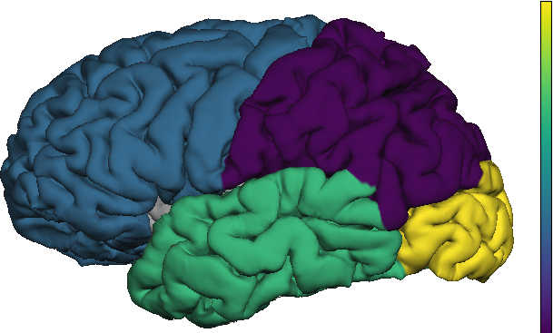
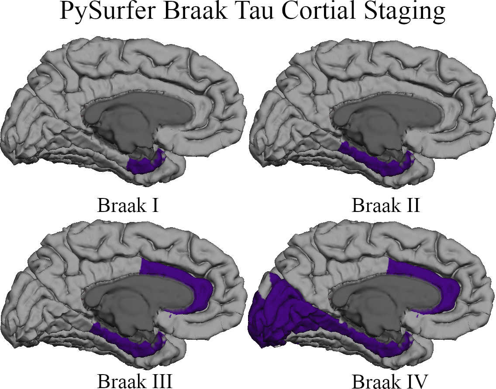
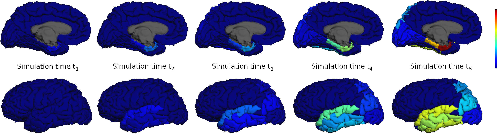

  

## PySurfing
### Visualizing with Freesurfer from Python
Freesurfer is a powerful tool and provides numerous capabilities for processing and analyzing MRI images.  Freesurfer also produces gray (and white) matter segmentations using parcellations derived from a user-defined (manual) labelling or from one of its [predefined atlases](http://https://surfer.nmr.mgh.harvard.edu/fswiki/CorticalParcellation).  Freesurfer also comes packaged with a handy tool, called *tksurfer*, that can color, for instance, the pial surface according to an atlas labelling.  **PySurfing** is an open-source tool, extending tksurfer, providing an interface to easily color regions of an Freesurfer atlas for which a (recon-all) segmentation has been performed.  **PySurfing** was inspried by the work of Dr. Anderson Winkler, [a 2011 Brainder.org blog post](https://brainder.org/2011/07/05/freesurfer-brains-in-arbitrary-colours/), and an interest in creating an accessible approach for anatomical visualizations of network neurodegeneration simulations.

**PySurfing** was conceptualized, and written, by [Georgia S. Brennan](https://twitter.com/gsbrennan), [Travis B. Thompson](https://twitter.com/mathemology), [Prof. Alain Goriely](http://goriely.com/) and [Prof. Marie E. Rognes](http://marierognes.org/); the vision of **PySurfing** is to provide a tool to easily visualize results from mathematical modelling on anatomical surfaces. 

### Software requirements

#### Primary software packages
**PySurfing** requires the following software to be installed
1. Freesurfer version 7 or greater ([download here](https://surfer.nmr.mgh.harvard.edu/fswiki/DownloadAndInstall))
2. Matlab version 2020b 
3. Python version 3.8 or greater

#### Python packages
**PySurfing** also makes use of the following python libraries which will need to be installed on your machine. 
1. matplotlib
2. numpy

#### Additional software requirements

##### Subject segmentation with Freesurfer
It is also assumed that you have performed a full [recon-all segmentation](https://surfer.nmr.mgh.harvard.edu/fswiki/recon-all/) on at least one patient in your Freesurfer subject directory (which can be found by typing `echo $SUBJECTS_DIR` in a terminal window).  Freesurfer comes with a default subject named "bert".  While you can certainly use any subject you wish with **PySurfing**, "bert" will always work just fine.  You can perform the required segmentation on "bert" by [typing the following command](https://surfer.nmr.mgh.harvard.edu/fswiki/TestingFreeSurfer) in a terminal window

> recon-all -s bert -all

Freesurfer segmentation can take several hours, or even up to a day, on most machines.

##### Connecting Matlab and Freesurfer
In your main Freesurfer directory (which can be found by typing `echo $FREESURFER_HOME` in a terminal window) you will find a subdirectory named *matlab*.  You will need to add this directory to your Matlab path.  This can be accomplishing using the Matlab GUI options or by issuing the `addpath('/[path to freesurfer]/matlab')` command in the Matlab command window.

##### Installing Dr. Anderson Winkler's replace_ctab script
**PySurfing** is a functionality-added wrapper of Dr. Anderson Winkler's [replace_ctab.m matlab script](https://brainder.org/2011/07/05/freesurfer-brains-in-arbitrary-colours/). The original replace_ctab.m script was written circa 2011.  We have updated the script for Matlab 2020b and, with Dr. Winkler's permission, have included an updated copy in this repository.  If you are using a version of Matlab before 2020b you may need to use the [original version](https://s3.us-east-2.amazonaws.com/brainder/2011/replace_ctab/replace_ctab.m) of the script from the [blog posting](https://brainder.org/2011/07/05/freesurfer-brains-in-arbitrary-colours/).

Whichever version of replace_ctab.m you use, you will need to copy this file to your Freesurfer's matlab directory (`$FREESURFER_HOME/matlab`).

### Using PySurfing

**PySurfing** aims to do three things:
1. Take the lookup work out of determining RGB values
2. Automate the matlab-to-Freesurfer pipeline which uses both replace_ctab.m and the *tksurfer* visualization tool.
3. Provide an extensible Python interface that provides more general visualization capabilities; especially for researchers who wish to view the results numerical simulations using Freesurfer.

**PySurfing** uses the concepts of *Parcellations* and *Activation Maps*.  Parcellations define basic anatomical structure and an Activation map provides a simplified interface to work with coloring parcellations.  If you are using **PySurfing** to easily visualize results using Freesurfer, the details here aren't really important.  

> A note to developers: If you are a developer, you can easily make your own parcellations and activation maps by extending the base classes defined in activationmaps/parcellations.py and activationmaps/activations.py, respectively.  If you are using the default Desikan-Killiany atlas, you can add your own functionality by deriving from the base classes `parcellationDesikanKillianyHemisphere` (in activationmaps/parcellations.py) and `activationDesikanKilliany` (in activationmaps/activations.py).

Freesurfer's supports the Desikan-Killiany (DK) parcellation by default.  **PySurfing** implements a DK parcellation and activation map that supports several easy-to-use interfaces for automatic visualization with *tksurfer*.  

#### A simple lobe-based activation visualization example
Imagine that an agent is traversing the various gray-matter regions of the brain.  This agent could be the concentration of a tracer or of a misfolded protein.  One could ask the following question: in what order do the lobes of the brain obtain an X% concentration of this agent?  For instance, in frontotemporal dementia we would expect the frontal lobe to obtain 5% concentration of tau aggregates before the occipital region.       

##### Specifying an activation map and a lobe activation order

The source file `lobe-activation-map-demo.py` includes an interactive example that shows how to use the lobe activation order interface of the `activationDesikanKilliany` activation class. The following code from `lobe-activation-map-demo.py` demonstrates:

	myActivationMap = activationDesikanKilliany()
	myActivationMap.setActivationOrder(2, 1, 3, 4)

Here, we have created an Desikan-Killiany activation object and specified the activation order of the lobes with `setActivationOrder(Frontal, Parietal, Temporal, Occipital)`.  The above code implies that the Parietal lobe is activated (i.e. has reached X%) first, followed by the Frontal lobe, the Temporal lobe and finally the Occipital lobe.  **PySurfing** can also make use of any colormap provided by *matplotlib*.  Activation objects can be configured to use a matplotlib colorscheme in a simple manner.  The following code demonstrates how to use the 'viridis' colorscheme for the lobe activation above: 

	viridis = cm.get_cmap('viridis')
	myActivationMap.setUseMatplotlibColorMap(True, cmap=viridis)
	
If the above code is specified before the call to `setActivationOrder(..)` then the `viridis` colormap will be used to set the colors for the lobe ordering.  

##### Visualizing an activation map using *tksurfer*
The basic visualization process for **PySurfing** is:
1. Create a CSV file with the RGB values for the parcellation (contained inside) of the current activation mapping object.
2. Call the Matlab 2020b batch interface to execute Dr. Winkler's replace_ctab.m script.  This script produces an annotation file from the RGB values in the CSV file.
3. Execute *tksurfer* to visualize the annotation file.  You can rotate, zoom, etc, using the *tksurfer* GUI and save the file to a tiff image by clicking the *save* button.

**PySurfing** uses a class called `fsVisualizeActivation` to handle the process above.  This class needs to know a few things in order to do its job:
1. The full path to Freesurfer
2. The full path to your Freesurfer subject directory
3. The name of the subject that you want to use for visualization
4. Any preload commands that *tksurfer* may need (see *An important remark on remote visualization* below)

**PySurfing** also assumes that `matlab` can be called from any directory by using the terminal command 
> matlab -batch "replace_ctab('*freesurfer annotation file*','*csv with RGB values*','*output annotation file*')

You should verify that `matlab -batch` can be run from a terminal window in any directory.  If not, you (or your administrator) should add matlab to your machine's PATH environment variable.  In order to proceed with visualization we need to tell the `fsVisualizeActivation` object about the four things above.  We can do this as follows
	
	visIt = fsVisualizeActivation()
	visIt.setFreesurferPath(freesurferPath)
    visIt.setFreesurferSubjectPath(freesurferSubjectPath)
    visIt.setFreesurferSubjectName(freesurferSubject)

Where `freesurferPath`, `freesurferSubjectPath` are fully-qualified paths (such as `/usr/local/freesurfer` and `/usr/local/freesurfer/subjects`) and `freesurferSubject` is the *name* of the subject directory you want to use; for example `bert`.  Currently, the `fsVisualizeActivation` object supports visualization on the left or right pial hemisphere surface.  Once the paths are set, we can initiate the visualization process with the following line

	visIt.visualizeHemisphereActivation(activationMap)
	
The process for visualizing an activation map is generic.  Thus, we won't repeat these steps in the discussions that follow.  The result is shown below; note that the parietal lobe has the lowest color value (activated first) followed by the frontal lobe (activated second), the temporal lobe (activated third) and the occipital lobe (activated fourth).

  

######  An important remark on remote visualization
If you are using **PySurfing** on a machine to which you are remotely connected (e.g. using X2go or similar) you may need to issue a pre-load command for tksurfer to work correctly.  To investigate this, you can try typing the following in a terminal window

	tksurfer bert lh pial

If the tksurfer window opens and you see a left pial surface displayed, then you do not need to preload anything.  However, if *tksurfer* opens and you see only a black square (with no pial surface) then you are experiencing a known issue between libGL and X2go (or your similar remote connection software).  In this case, you may need to preload a different version of libGL in order for *tksurfer* to display correctly over your remote connection.  Matlab comes packaged with a version of libGL that works with many remote clients.  Since we need Matlab anyway, we can safely assume it is installed on your system.  We can test using Matlab's libGL by issuing the following command from a terminal window

	LD_PRELOAD=[path to Matlab]/sys/opengl/lib/glnxa64/libGL.so.1 tksurfer bert lh pial
	
For instance, if matlab is installed at `/opt/matlab` the above would simply be

	LD_PRELOAD=/opt/matlab/sys/opengl/lib/glnxa64/libGL.so.1 tksurfer bert lh pial

If this command works then we need to tell our `fsVisualizeActivation` object about the *tksurfer* preload command.  This can be done with the statement
	
	visIt.setTksurferPreloadCommand(tkpreload)
	
before the call to `visIt.visualizeHemisphereActivation(activationMap)` where `tkpreload` is a string whose contents is all of the text that comes before the `tksurfer` command.  For example, to visualize with *tksurfer* and the Matlab ligGL preload, above, we would use 

	tkpreload = 'LD_PRELOAD=/opt/matlab/sys/opengl/lib/glnxa64/libGL.so.1'
	visIt.setTksurferPreloadCommand(tkpreload)
	visIt.visualizeHemisphereActivation(activationMap)

#### A staging series activation visualization example
Network neurodegeneration models often encounter questions of the *staging*, or ordering, of the regions of visitation of a protein agent in a series.  For instance, staging arises in the study of Alzheimer's disease tau pathology where both tau seeds and neurofibrillary tangles proceed through a specific sequence of regions called the *Tau Braak Stages*.
**PySurfing** activation maps can be used to easily visualize staging processes. 

##### Sequenced staging with PySurfing
Staging is similar to lobe-based activation but, instead of lobes, every anatomical region of the brain is considered to be "activatable".  A *staging sequence* is essentially a *series* of regions which you expect to be "activated" sequentially.  Here, "activation" could mean that a toxic seeding is measured at a given concentration, or that the first aggregate is detected, or that an SUVR intensity reaches a given threshold, etc.  There are many ways to conceptualize a staging series activation.  

**PySurfing** provides two interfaces that can be used for sequenced activation map staging.  These are the *parcellation interface* and the *StagingMap* interface.   The use of both interfaces is demonstrated in the example file `series-activation-map-demo.py`.

###### Direct activation using the parcellation of an activation map
The function `demoSingleRegionActivation()`, in the file `series-activation-map-demo.py`, demonstrates how the parcellation object of an activation map can be retrieved in order to "activate" a region with a value, directly.  First, as we have seen in the previous example, a Desikan-Killiany activation map is created and a matplotlib colormap is selected; here, the viridis colormap is selected.

	myActivationMap = activationDesikanKilliany()
    viridis = cm.get_cmap('viridis')
    myActivationMap.setUseMatplotlibColorMap(True, cmap=viridis)

Every activation map class contains a parcellation that it "activates" in various ways.  The Desikan-Killiany activation, naturally, contains an instance of the Desikan-Killiany parcellation; in this case for a hemisphere of the brain (see the `parcellationDesikanKillianyHemisphere` object in the file `activationmaps/parcellations.py` for more detail here).  We now retrieve the parcellation object directly from the activation map as 

	parc = myActivationMap.getParcellation()
    
Now we acivatte all of the regions to their default **Freesurfer** RGB value (which is gray) and retrieve the parcellation's *region value dictionary*.  These two things are accomplished by 
	
    parc.resetToDefaultRGB()
    parcValues = parc.getRegionValueDictionary(floatval=0.0)

A *region value dictionary* of a parcellation is Python dictionary whose keys are the *region names* and the values of the dictionary are floating point *activation values*.  These *activation values* will, ultimately, be assigned to colors.  The `floatval` option, in the code above, specifies the initial *activation value* that each region should be assigned; in this case, we have selected an initial activation value of `0.0` for each region.  Next, we set the *activation value* of the *entorhinal cortex* to `1.0`.  We can do this with our *region value dictionary* `parcValues` as 

	parcValues['entorhinal'] = 1.0
	
Now, we pass our *activation values* for each region back to the activation map and provide upper and lower bounds so that the activation map knows how we want to color activations in each individual region.  We do this as follows:

	parc.setRGBfromValueDictionary(parcValues, min=0.0, max=1.0, setMinToDefaultRGB=True)

The first argument is the *region value dictionary* where we set the *activation values* for each parcellation region.  The option `min` specifies the minimum we want to use for 
coloring (typically, the minimum activation value in our region value dictionary) and the option `max` specifies the maximum we wish to use for coloring (typically, the maximum value in our region value dictionary).  Finally, the option `setMinToDefaultRGB=True` tells the activation map to color all regions whose activation value equals the `min` value to the **Freesurfer** default (gray) RGB value.  Specifying `setMinToDefaultRGB=False` will, instead, color minimal regions, and all others, based on the color scheme that was selected.  The activation map is then visualized using the methods that were previously discussed (see the above section: Visualizing an activation map using *tksurfer*).

###### Series activation using the StagingMap interface

The `StagingMap` interface is a simple interface that lets you visualize a staging sequence quickly and easily; this interface is specifically useful when you don't need low-level control over the different activation values of the individual regions (as we used above).  Using the `StagingMap` interface is demonstrated in the function `demoStagingActivation()` in the file `series-activation-map-demo.py`.  First, a Desikan-Killiany activation map is created and, this time, we choose the `Purples` color scheme for visualization:

    myActivationMap = activationDesikanKilliany()  
    purple = cm.get_cmap('Purples')
    myActivationMap.setUseMatplotlibColorMap(True, cmap=purple)

Next, we get an empty `StagingMap` object from our activation mapping; we tell the staging map that we want to visualize 4 different stages.  

	devosBraakStaging = myActivationMap.getEmptyStagingMap(4)

These 4 stages correspond to the cortical regions in a Braak staging for misfolded Tau seeding; the interested reader can find more detail [here](https://www.biorxiv.org/content/10.1101/2021.01.21.427609v2) and [here](https://doi.org/10.3389/fnins.2018.00267).  We now specify the four stages using the anatomical labels in the Desikan-Killiany atlas as 
	
    devosBraakStaging[1] = ['entorhinal'] 
    devosBraakStaging[2] = ['parahippocampal'] 
    devosBraakStaging[3] = ['rostralanteriorcingulate', 'caudalanteriorcingulate']
    devosBraakStaging[4] = ['cuneus', 'pericalcarine', 'lateraloccipital', 'lingual']

We can then visualize any of these stages by calling the activation map function `setActivationFromStage` which colors the regions according to the activation values of 
the desired `StagingMap`.  For example:

	myActivationMap.setActivationFromStage(devosBraakStaging, 2, appendPrior=False)

Would activate the second stage of our `devosBraakStaging` map which, in this case, is the `parahippocampal` region alone.  The option `appendPrior=False` means that stages before the current stage should not also be activated.  If, for instance, we set `appendPrior=True` in the above call then both `entorhinal` (stage 1) and `parahippocampal` (stage 2) would be activated by the code snippet above.  Thus, we could use the above `StagingMap` to create figures for a progressive Braak staging with the following code snippet: 

	for i in range(4):
        myActivationMap.setActivationFromStage(devosBraakStaging, i+1, appendPrior=True)
        vis(myActivationMap)

In the above code, the option `appendPrior=True` indicates that all previous stages should be visualized when a given stage is.  The function `vis(..)` is defined in `series-activation-map-demo.py` and simply encapsulates the standard visualization steps discussed previously.  The result is shown below; the option `appendPrior=True` was used to show progression through the four defined (cortical) Braak Tau stages, above.

  

#### PySurfing and network neurodegeneration
One of the design goals behind **PySurfing** was the desire to visualize results from network neurodegeneration mathematical model simulations more easily.  These simulations often produce results for a given anatomical region across various times.  For instance, the results of a [Fisher-Kolmogorov model](https://royalsocietypublishing.org/doi/full/10.1098/rsif.2019.0356) of misfolded protein concentration may produce 100 outputs starting with an initial time, , at 0.0 and ending with time step, , at 1.0.  Such a model would take the form

where |V| denotes the number of anatomical regions,  denotes the *graph Laplacian tensor* and  represents the concentration of a misfolded protein in a specific anatomical region (corresponding to the index `i`).  The interested reader is encouraged to look [here](https://royalsocietypublishing.org/doi/full/10.1098/rsif.2019.0356) for several nice examples of such models.  

We now suppose that we have run some such simulation and we have, for each of our 100 time points, a floating point value between 0.0 and 1.0 for each of our anatomical regions.  Let us also suppose that we also know that each of our indices (`i`) corresponds to some region in the Desikan-Killiany atlas; for instance `i=1` might correspond to the *entorhinal* region while `i=2` is the *parahippocampal* region, etc.  Then we might want to plot 5 evenly spaced results (at times 0.0, 0.25, 0.50, 0.75 and 1.0) for various region using **PySurfing**.  That is, we want to visualize these simulation results as **PySurfing** *activation values*.  

##### Sample simulated data
Suppose that our network neurodegeneration simulation has produced the following data (c.f. below). For this simple example, we will assume that all other regions, not appearing below, in the Desikan-Killiany atlas are uniformly zero for all times.

| Region          | t=0.0 | t=0.25 | t=0.5 | t=0.75 | t=1.0 |
| --------------- | ----- | ------ | ----- | ------ | ----- |
| entorhinal      | 0.1   |  0.23  | 0.28  |  0.52  |  0.98 |
| parahippocampal | 0.0   |   0.1  | 0.18  |  0.44  |  0.7  |
| inferiortemporal| 0.0   |  0.07  | 0.12  |  0.32  |  0.6  |
| middletemporal  | 0.0   |  0.04  | 0.13  |  0.28  |  0.55 |
| superiortemporal| 0.0   |  0.09  | 0.22  |  0.45  |  0.62 |
| inferiorparietal| 0.0   |  0.0   | 0.1   |  0.18  |  0.33 |
| superiorparietal| 0.0   |  0.0   | 0.06  |  0.15  |  0.28 |
| lateraloccipital| 0.0   |  0.0   | 0.02  |  0.08  |  0.13 |
| lingual         | 0.0   |  0.0   | 0.01  |  0.07  |  0.11 |
| cuneus          | 0.0   |  0.0   | 0.01  |  0.06  |  0.10 |

##### Visualizing simulation results using the SimulationMap interface
**PySurfing** provides a simple-to-use activationMap interface specifically for the visualization of network neurodegeneration simulation results.  This code for this demo is provided in the file `simulation-activation-map-demo.py`.  First, we create the Desikan-Killiany activation map; this time we select a *jet* color scheme

	myActivationMap = activationDesikanKilliany()
    mycmap = cm.get_cmap('jet')
    myActivationMap.setUseMatplotlibColorMap(True, cmap=mycmap)

Next, we enter our simulation results; these might come, for instance, from an external solver package but for this example we simply create them as a standard Python dictionary.

    simValues = {'entorhinal':[0.1, 0.23, 0.28, 0.52, 0.98], 
                 'parahippocampal': [0.0, 0.1, 0.18, 0.44, 0.7], 
                 'inferiortemporal': [0.0, 0.07, 0.12, 0.32, 0.6],
                 'middletemporal': [0.0, 0.04, 0.13, 0.28, 0.55], 
                 'superiortemporal': [0.0, 0.09, 0.22, 0.45, 0.62],
                 'inferiorparietal': [0.0, 0.0, 0.1, 0.18, 0.33], 
                 'superiorparietal': [0.0, 0.0, 0.06, 0.15, 0.28],
                 'lateraloccipital': [0.0, 0.0, 0.02, 0.08, 0.13], 
                 'lingual': [0.0, 0.0, 0.01, 0.07, 0.11],
                 'cuneus': [0.0, 0.0, 0.01, 0.06, 0.10]}

The next step is to retrieve an empty `SimulationMap` from our **PySurfing** activation map class.  This is done with 

	simulationResults = myActivationMap.getEmptySimulationMap(simMinval=0.0,simMaxval=1.0)

Since our activation map is a `DesikanKilliany` object it populates the `SimulationMap` with the labels (anatomical regions) from the Desikan Killiany anatomical atlas.  The options `simMinval` and `simMaxval` set the bounds for the *activation values* that will be used by the `SimulationMap` and are important for determining the color values we will see.  Since our sample data consists of normalized concentrations, we have used `simMinval=0.0` and `simMaxval=1.0`.  

We can visualize the current state of our `SimulationMap` object, called `simulationResults` above, by calling 

	myActivationMap.setActivationFromSimulationResult(simulationResults)

A `SimulationMap` is simply a dictionary whose keys are the regions of the parcellation and whose values are the (activation) values we wish to visualize.  We could, for instance, set 

	simulationResults['entorhinal'] = 1.0
	
and leave the rest of the regions alone. If we were to then call the `setActivationFromSimulationResults(..)` function, only the `entorhinal` region would be activated and it would show the RGB color corresponding to `1.0` in the `jet` colorscheme.
However, we want to visualize the results for the data corresponding to all 5 timepoints.  This can be achieved by using the following loop

	nSimTimes = 5
    for t in range(nSimTimes):
        for region in simValues:
            simulationResults[region] = simValues[region][t]
			
        myActivationMap.setActivationFromSimulationResult(simulationResults)
        vis(myActivationMap)
		
In the loop above, we iterate over the `simValues` dictionary keys; these are our region names.  For each region name we then set the corresponding value for time `t` (where `t=0,1,2,3,4`) and then call the `vis(..)` function; the `vis(..)` function is defined in the file `simulation-activation-map-demo.py` and contains the usual visualization steps that we have discussed throughout this document.  The five time-point simulation results are shown below.

  

